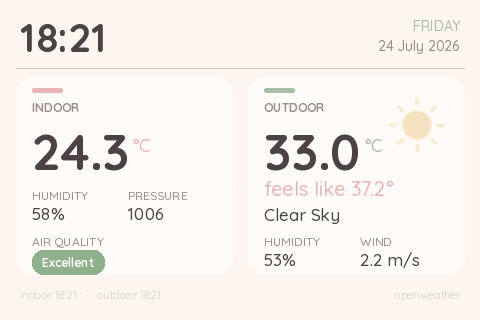
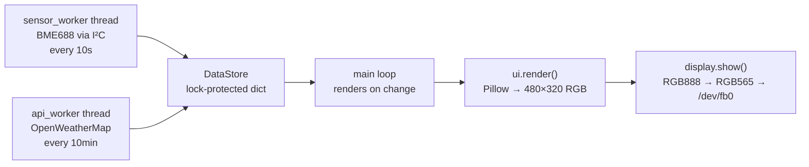

# Weather Station

A always-on desktop weather station built on a Raspberry Pi 4 — indoor air readings from a Bosch BME688 sensor, outdoor conditions from the OpenWeatherMap API, drawn to a 3.5" SPI LCD through a hand-built Pillow UI with no GUI framework underneath.



Every pixel on that screen is drawn by `ui.py` and pushed straight to the framebuffer. There is no desktop environment, no Tkinter, no web view — just Pillow composing a 480×320 image and a converter writing raw RGB565 bytes to `/dev/fb0`.

---

## Contents

- [What it does](#what-it-does)
- [How it works](#how-it-works)
- [Repository layout](#repository-layout)
- [Hardware](#hardware)
- [Wiring](#wiring)
- [Setup](#setup)
- [Configuration](#configuration)
- [Running it](#running-it)
- [Design notes](#design-notes)
- [Roadmap](#roadmap)

---

## What it does

**Indoor**, read from the BME688 over I²C every 10 seconds:

- Temperature (°C)
- Relative humidity (%)
- Barometric pressure (hPa)
- Air quality, derived from the sensor's gas-resistance reading and labelled Excellent / Good / Fair / Poor

**Outdoor**, fetched from OpenWeatherMap every 10 minutes:

- Current temperature and feels-like temperature
- Condition description with a matching hand-drawn icon
- Wind speed and humidity

**Plus:**

- Live clock and date
- Per-source freshness timestamps, so a stale reading is visible rather than silently wrong
- Automatic overnight dimming to 45% brightness between 10pm and 7am
- Auto-starts on boot as a systemd service and runs headless — no keyboard, no mouse, no monitor

---

## How it works

Three concerns run independently so that a slow sensor read or a dead network connection can never freeze the screen.



Two daemon threads poll their data sources on their own schedules and write into a shared `DataStore`. The store guards every read and write with a `threading.Lock`, so the render loop always sees a coherent snapshot rather than a half-updated dict.

The main loop wakes ten times a second but only redraws when something visible has actually changed. It builds a small fingerprint — the current `HH:MM`, plus the two update timestamps — and compares it to the last frame it drew. Since the clock only displays minutes, redrawing on every tick would push roughly 600 identical frames per minute at the framebuffer for nothing. On a 2GB Pi that headroom is worth keeping.

Failure is handled by returning `None` rather than raising. A failed sensor read or a network timeout leaves the last good value on screen with its original timestamp, and the UI renders a `—` placeholder for anything that has never arrived. The station keeps running through a Wi-Fi dropout and shows honestly stale data instead of crashing.

---

## Repository layout

| File | Role |
|---|---|
| `station.py` | Entry point. Spawns the worker threads and runs the render loop. |
| `data_store.py` | Thread-safe container for the latest indoor and outdoor readings. |
| `sensors.py` | BME688 I²C reads and the gas-resistance → air-quality mapping. |
| `weather_api.py` | OpenWeatherMap client with timeout and error handling. Runnable standalone to test the API. |
| `ui.py` | The whole interface — layout, cards, typography, dimming. Runnable standalone to write `preview.png`. |
| `icons.py` | Weather icons drawn from scratch with Pillow primitives. |
| `theme.py` | Colour palette and font definitions. The single place to restyle the UI. |
| `display.py` | RGB888 → RGB565 conversion and the framebuffer write. Runnable standalone as a colour-bar test. |
| `test_display.py` | Standalone framebuffer test — writes shapes and text straight to `/dev/fb0` to prove the LCD works before any of the UI exists. |
| `fonts/` | Quicksand (Light / Medium / Bold). |
| `weather-station.service` | systemd unit for auto-start on boot. |

Three modules run standalone for testing, which is what made the project tractable to build in stages:

```bash
python weather_api.py   # prints a live outdoor fetch, no hardware needed
python ui.py            # writes preview.png from sample data, no hardware needed
python display.py       # colour bars + gradient on the LCD, no sensor needed
```

---

## Hardware

| Component | Part |
|---|---|
| Computer | Raspberry Pi 4 Model B (2GB), Raspberry Pi OS 64-bit |
| Environmental sensor | Bosch BME688 breakout — Adafruit #5046 |
| Display | Waveshare 3.5" IPS LCD, SPI, 480×320 |
| Storage | 32GB microSD, Class 10 |
| Power | USB-C 5V / 3A |
| Prototyping | Breadboard and jumper wires |

---

## Wiring

All pin numbers below are **physical board pins** — counted along the 40-pin header, not BCM/GPIO numbers.

### BME688 → Raspberry Pi (I²C)

| BME688 | Pi physical pin | Function |
|---|---|---|
| VIN | 1 | 3.3V power |
| GND | 6 | Ground |
| SDA | 3 | I²C data (GPIO 2) |
| SCL | 5 | I²C clock (GPIO 3) |

I²C address: `0x77`. Confirm the sensor is present with `i2cdetect -y 1` — it should show `77` in the grid.

### Waveshare 3.5" LCD → Raspberry Pi (SPI)

| LCD | Pi physical pin | Function |
|---|---|---|
| VCC | 2 | 5V power |
| GND | 6 | Ground |
| DIN | 19 | SPI MOSI (GPIO 10) |
| CLK | 23 | SPI clock (GPIO 11) |
| CS | 24 | Chip select (GPIO 8, CE0) |
| DC | 22 | Data/command (GPIO 25) |
| RST | 18 | Reset (GPIO 24) |
| BL | 12 | Backlight (GPIO 18) |

Pin 6 is a single ground pin shared by both devices — any of the header's ground pins works if it is more convenient to route.

---

## Setup

**1. Enable the I²C and SPI buses.** Both are off by default on Raspberry Pi OS.

```bash
sudo raspi-config
# Interface Options → I2C  → Enable
# Interface Options → SPI  → Enable
sudo reboot
```

**2. Clone and create a virtual environment.** Raspberry Pi OS Bookworm blocks system-wide `pip install` (PEP 668), so a venv is required rather than optional.

```bash
git clone https://github.com/jzazhou/weather-station.git ~/weather_station
cd ~/weather_station
python3 -m venv venv
source venv/bin/activate
pip install -r requirements.txt
```

**3. Check that the LCD is mapped to `/dev/fb0`.** `display.py` writes to that device directly. Depending on how the Waveshare driver is installed, the SPI panel may come up as `/dev/fb1` instead, with `fb0` belonging to HDMI.

```bash
ls /dev/fb*
fbset -fb /dev/fb0 -i    # should report 480x320
```

If the panel is on `fb1`, either point `FB_DEVICE` in `display.py` at it or run `fbcp` to mirror. Running `python display.py` should paint red, green, blue, white, then a gradient — if the colours appear in the wrong order, the ILI9486 controller is expecting a different byte order and the shifts in `rgb888_to_rgb565` need adjusting.

**4. Verify the sensor.**

```bash
i2cdetect -y 1
```

---

## Configuration

`config.py` holds the API key and is deliberately **not** committed. Copy the template and fill it in:

```bash
cp config.example.py config.py
nano config.py
```

| Setting | Meaning |
|---|---|
| `OWM_API_KEY` | OpenWeatherMap API key — free tier is sufficient ([get one here](https://openweathermap.org/api)) |
| `CITY_NAME` | City for outdoor readings, e.g. `"Ithaca"` |
| `COUNTRY_CODE` | ISO country code, e.g. `"US"` |
| `UNITS` | `"metric"` for °C and m/s |
| `SENSOR_INTERVAL` | Seconds between sensor reads (default `10`) |
| `API_INTERVAL` | Seconds between API calls (default `600`) |

A new OpenWeatherMap key takes up to a couple of hours to activate. A `401` immediately after signing up usually means the key is valid but not live yet.

Keep `API_INTERVAL` at 600 or higher. The free tier allows 60 calls/minute and 1,000,000/month, so a 10-minute interval sits far inside the limit while still being fresher than the weather actually changes.

---

## Running it

Manually, to watch the log output:

```bash
source venv/bin/activate
python station.py
```

As a service, so it survives reboots and restarts itself if it crashes:

```bash
sudo cp weather-station.service /etc/systemd/system/
sudo systemctl daemon-reload
sudo systemctl enable weather-station
sudo systemctl start weather-station
```

Check on it:

```bash
systemctl status weather-station      # is it running?
journalctl -u weather-station -f      # follow the live log
```

The unit file assumes the project lives at `/home/pi/weather_station` and runs as user `pi`. If your username differs, edit `User=`, `WorkingDirectory=` and `ExecStart=` to match. `Restart=on-failure` with `RestartSec=5` means a transient crash brings the station back in five seconds instead of leaving a dark screen.

---

## Design notes

**Drawing to the framebuffer directly.** `/dev/fb0` is a file that is the screen — bytes written to it become pixels. `display.py` converts Pillow's 24-bit RGB into the 16-bit RGB565 format the panel expects by discarding low-order bits from each channel and packing them into two bytes, using NumPy to do it across the whole array at once rather than pixel by pixel. Writing a full 480×320 frame is a single `write()` of 307,200 bytes. This is what lets the station run with no desktop environment at all, which saves both memory and boot time.

**Icons drawn in code.** `icons.py` builds every weather icon from Pillow primitives — the sun is a disc with eight tapered rays, the crescent moon is a disc with an offset disc punched out of it as fully transparent pixels. They are rendered at 4× and downsampled, which is a cheap way to get anti-aliased edges out of a library that does not anti-alias. Nothing is a bitmap asset, so an icon can be recoloured or resized by changing an argument.

**A theme file with one job.** Colours and fonts live in `theme.py` and nowhere else. Restyling the entire interface means editing one 41-line file — the layout code never names a colour literal.

**Designing without the hardware.** `ui.py` renders from a sample dictionary and writes `preview.png` when run directly, so the visual design could be iterated on a laptop in seconds rather than by redeploying to the Pi. That preview is the image at the top of this README.

**Every field can be `None`.** At boot, before the first sensor read lands, and during any outage, `None` is the truthful value — so the layout is written to survive it everywhere rather than assuming data exists.

---

## Roadmap

- **DHT22 as a fallback sensor** — wired to a single GPIO pin, to cross-check the BME688 and keep temperature and humidity on screen if the I²C sensor drops out
- **Custom enclosure** — to be designed in Tinkercad and 3D printed, matching the UI's palette and rounded geometry
- **Historical logging** — persist readings to SQLite and add a 24-hour sparkline to each card
- **Pressure-trend indicator** — rising/falling arrow from the pressure history, a genuinely useful short-term forecast signal
- **Hardware backlight dimming** — PWM on the BL pin (GPIO 18) instead of the current software brightness multiply, for real power savings overnight
- **Multi-screen rotation** — a forecast view and an air-quality-history view, cycling on a timer

---

Built by a first-year Electrical and Computer Engineering student at Cornell University as a first hands-on embedded systems project.
